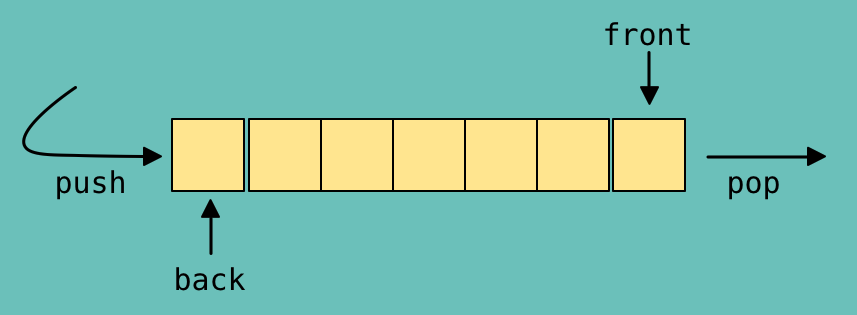

# 5.2.5 큐




- 큐(queue)는 **먼저 집어넣은 데이터가 먼저 나오는 성질**(`FIFO`, First In First Out)을 지닌 자료 구조
- 나중에 집어넣은 데이터가 먼저 나오는 스택과는 반대되는 개념을 가짐
- **삽입 및 삭제** => `O(1)`
- **탐색** => `O(n)`
- **CPU 작업을 기다리는 프로세스, 스레드 행렬 또는 네트워크 접속을 기다리는 행렬, 너비 우선 탐색, 캐시** 등에 사용됨
- C++에서 enqueue()는 push(), dequeue()는 pop()으로 구현되었음

```c++
#include<iostream>
#include<queue>
using namespace std;

int main() {

	//큐 선언
	queue<int> que;

	//큐에 요소 추가하기
	for (int i = 0; i < 5; i++) {
		que.push(i);
	}

	//요소 삭제하기
	int output = que.front();
	que.pop();
	
	//큐의 전체요소 출력하기
	while (!que.empty()) {
		cout << que.front() << " ";
		que.pop();
	}


	return 0;
}
```