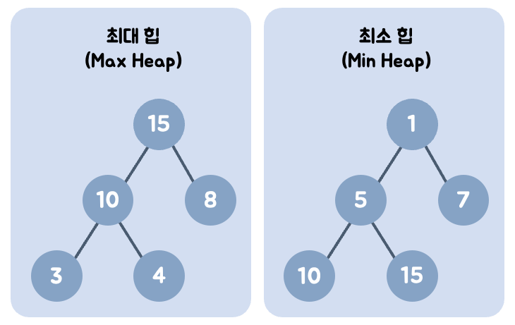
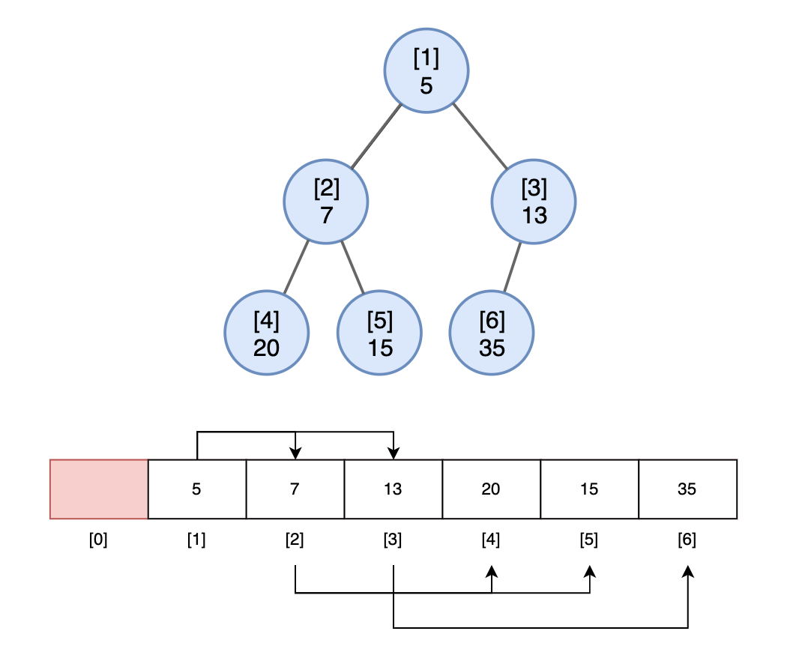
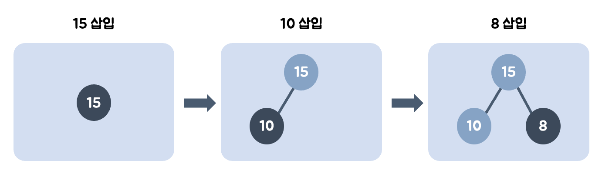
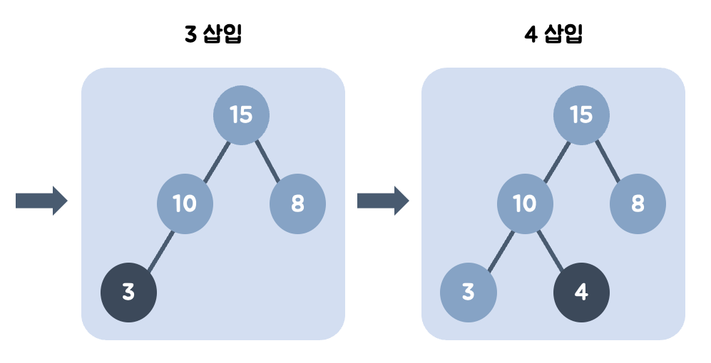
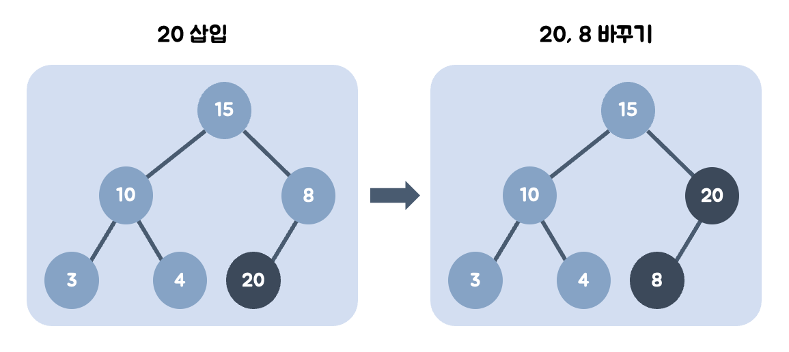
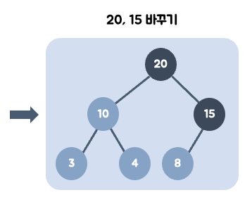
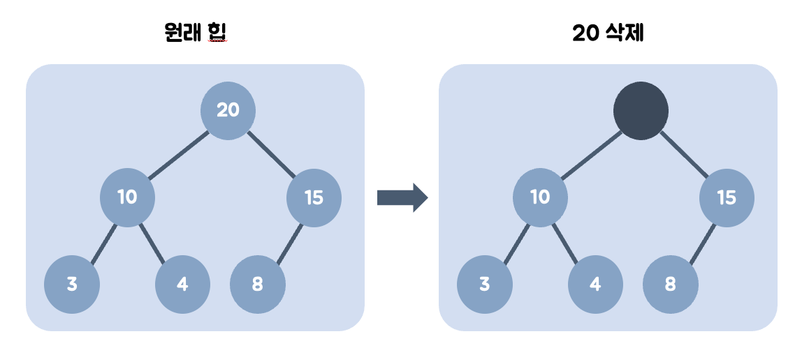
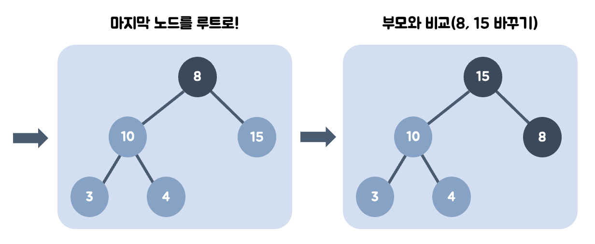

# 5.3.3_힙

## 1. 힙(Heap)

### 1.1 힙(Heap) 개요

#### 1. 목적
- 최댓값과 최솟값을 빠르게 찾기

#### 2. 특징
- 완전 이진트리를 기본으로 한 자료구조
- 부모노드의 키값과 자식노드의 키값 사이에는 대소 관계가 성립
	- 오직 부모자식 간에만 성립하며, 형제 사이에는 대소 관계가 성립하지 않음

#### 3. 힙의 종류
1. 최대 힙
	-   부모 키값이 자식노드 키값보다 큰 힙
	-   Key(parent) ≥ Key(child)
	-   가장 큰 값이 루트노드에 있음
2. 최소 힙
	-   부모 키값이 자식노드 키값보다 작은 힙
	-   Key(parent) ≤ Key(child)
	-   가장 작은 값이 루트노드에 있음


#### 4. 힙 표현
- 일반적으로 배열로 표현
- 개발 편의성, 가독을 위해 배열 인덱스 1부터 사용
- 루트 노드의 인덱스 i = 1인 경우 다음과 같은 속성을 지님
	- 노드 i의 부모 노드 인덱스 : i // 2
	- 노드 i의 왼쪽 자식 노드 인덱스 : 2 * i
	- 노드 i의 오른쪽 자식 노드 인덱스 : 2 * i + 1
	

## 2. 힙 연산

- 최대 힙을 예시로 사용

### 2.1 삽입 연산 (insertion)

#### 1. 데이터 삽입
- 삽입할 노드는 기본적으로 왼쪽 최하단부 노드부터 채움
- 

1.  15를 왼쪽 최하단 노드에 삽입
2.  10을 왼쪽 최하단 노드에 삽입한 뒤, 부모와 비교해 위치를 정함 (그대로)
3.  왼쪽 최하단 노드가 이미 있으므로 8을 오른쪽 최하단 노드에 삽입한 뒤, 부모와 비교해 위치를 정함 (그대로)
4. 3을 왼쪽 최하단 노드에 삽입한 뒤, 부모와 비교해 위치를 정함 (그대로)
5.  왼쪽 최하단 노드가 이미 있으므로 4를 오른쪽 최하단 노드에 삽입한 뒤, 부모와 비교해 위치를 정함(그대로)

#### 2. 데이터 삽입 : 힙의 데이터보다 클 때
-  
1.  20을 왼쪽 최하단부 노드에 삽입
2.  20의 부모 노드인 8과 비교 후, 20이 더 크므로 8과 위치를 바꿈 (swap)
3. 3.  20의 부모 노드인 15와 비교 후, 20이 더 크므로 15와 위치를 바꿈 (swap)


### 2.2 삭제 연산 (deletion)
- 힙 자료구조의 목표는 최대값 or 최소값을 알아내는 것
- 따라서, 데이터가 삭제될 경우 가장 큰 값인 부모 노드의 값이 삭제됨
-   
1.  최대값을 갖는 부모 노드를 삭제
2.  부모 노드가 비었으므로, 가장 최하단부 노드를 루트로 옮김
3.  부모 노드인 8보다 값이 큰 자식 노드가 있는지 비교
	1. 왼쪽, 오른쪽 자식 노드 모두 부모 노드보다 클 경우
	    -   왼쪽, 오른쪽 자식 노드를 비교하여, 더 큰 자식 노드와 부모 노드의 위치를 바꿈 (swap)
	2. 왼쪽, 오른쪽 자식 노드 중 하나만 부모 노드보다 클 경우
		-   둘 중에 부모 노드보다 큰 자식 노드와 부모 노드의 위치를 바꿈 (swap)

## 3. 힙 연산 in python

### 3.1 힙 생성하기
- 먼저 Heap 클래스를 생성해 초기화
- 루트의 인덱스 번호를 1로 하기 위해, 리스트의 0번째 자리에 None을 넣어둠	```python
	```python
	class Heap:
	    def __init__(self):
	        self.heap = []
	        self.heap.append(None)
	```
### 3.2 데이터 삽입하기
- 데이터를 삽입할 때, 맨 뒤부터 차례대로 저장함
- 만약 삽입한 데이터가 부모보다 클 경우, 부모와 위치를 바꿈
	```python
	# 해당 노드가 부모 노드보다 큰지 비교
	def check_swap_up(self, idx):
		# 삽입한 모드의 부모 노드가 없을 경우
	    if idx <= 1:
	    	return False
	
		parent_idx = idx // 2
	
		if self.heap[idx] > self.heap[parent_idx]:
			return True
		else:
	    return False
	
	# 데이터 삽입
	def insert(self, data):
		self.heap.append(data)
	    idx = len(self.heap) - 1
	
	    # check_swap_up() 의 값이 참이라면 부모와 위치 바꾸기
	    while self.check_swap_up(idx):
	    	parent_idx = idx // 2
	
	        self.heap[idx], self.heap[parent_idx] = self.heap[parent_idx], self.heap[idx]
	        idx = parent_idx
	
		return True
	```
### 3.3 삭제하기
- 최댓값을 꺼내면 그 자리, 즉 루트 노드가 비어있게 됨
- 가장 마지막 노드와 루트 노드의 자리를 바꾼 뒤, 자식 노드와 값을 비교
- 만약 루트 노드가 자식 노드보다 더 작을 경우, 자식과 위치를 바꿈
- 자식이 하나만 있을 때는 자식과 부모만 비교하고, 둘 다 있을 때는 자식끼리 먼저 비교하여 더 큰 자식과 부모를 비교
	```python
	# 해당 노드가 부모 노드보다 큰지 비교
	def check_swap_down(self, idx):
		left_idx = idx * 2
	    right_idx = idx * 2 + 1
	        
	    # 자식 노드가 하나도 없을 경우
	    if left_idx >= len(self.heap):
	    	return False
	        
		# 왼쪽 자식 노드만 있을 경우
	    elif right_idx >= len(self.heap):
	    	if self.heap[left_idx] > self.heap[idx]:
	        	self.flag = 1
	            return True
			else:
	        	return False
	        
		# 자식 노드가 모두 있을 경우
	    else:
	    	if self.heap[left_idx] > self.heap[right_idx]:
	        	if self.heap[left_idx] > self.heap[idx]:
	            	self.flag = 1
	                return True
				else:
	            	return False
			else:
	        	if self.heap[right_idx] > self.heap[idx]:
	            	self.flag = 2
	                return True
				else:
	            	return False
	
	# 데이터 삭제
	def pop(self):
		if len(self.heap) <= 1:
	    	return None
	        
		max = self.heap[1]
	    self.heap[1] = self.heap[-1]
	    del self.heap[-1]
	    idx = 1
	
	    # 0 = False, 1 = (왼쪽 자식과 swap), 2 = (오른쪽 자식과 swap)
	    self.flag = 0 
	
	    while self.check_swap_down(idx):
	    	left_idx = idx * 2
	        right_idx = idx * 2 + 1
	
	        if self.flag == 1:
	        	self.heap[idx], self.heap[left_idx] = self.heap[left_idx], self.heap[idx]
	            idx = left_idx
			elif self.flag == 2:
	        	self.heap[idx], self.heap[right_idx] = self.heap[right_idx], self.heap[idx]
	            idx = right_idx
		return max
	```
### 3.4 모듈 사용하기
- 파이썬 내장 모듈인 heapq를 사용할 수 있음
``` python
import heapq
heap = []
heapq.heappush(heap, 1)
heapq.heappush(heap, 5)
heapq.heappush(heap, 3)
heapq.heappush(heap, 6)  # heap에 원소 넣기
heapq.heappop(heap)      # heap에서 최소값 뽑기
heapq.heapify(heap)      # 기존 리스트를 heap으로 만들기
```