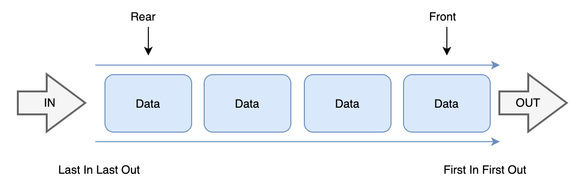
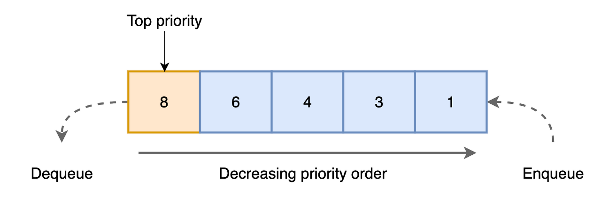
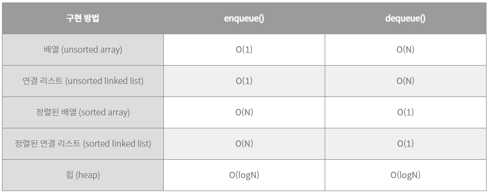

## 1. 우선순위 큐 (Priority Queue)

### 1.1 큐 (Queue)
- 먼저 집어넣은 데이터가 먼저 나오는 선입선출(FIFO, First in First Out) 구조로 저장하는 선형 자료구조
	

### 1.2 우선순위 큐 (Priority Queue)

- 먼저 들어오는 데이터가 아닌, 우선순위가 높은 데이터가 먼저 나가는 형태의 자료구조
		
- 4 → 8 → 2 순으로 데이터가 들어간다고 했을 때 큐와 우선순위 큐의 처리 순서 (높은 값이 높은 우선순위를 갖는다고 가정)
	- input : 4 → 8 → 2
	- 큐 : 4 → 8 → 2
	- 우선순위 큐 : 8 → 4 → 2

## 2. 우선순위 큐 구현

### 2.1 구현 방식
- 구현 방식 별 시간 복잡도
 
- == 힙의 시간 복잡도가 가장 낮기 때문에 일반적으로 힙을 사용해 구현함
	- 최대 힙에서 노드의 키 값을 우선 순위로 생각하면 됨

### 2.2 기본 동작
- enqueue() : queue에 새 요소를 삽입
- dequeue() : queue에서 최대 우선 순위 요소를 삭제하고 그 값을 반환
- peek() : queue에서 최대 우선순위 요소를 반환
- heap의 연산과 동일함