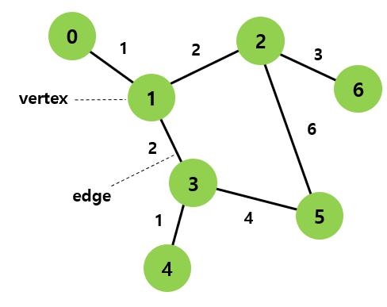
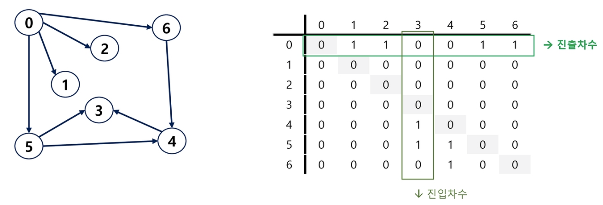

# 5.3.1 그래프

- 정점과 간선으로 이루어진 `비선형 자료 구조`의 일종
    - 비선형 자료 구조 : 일렬도 나열하지 않고 자료 순서나 관계가 복잡한 구조

## 1. 그래프의 정의

- 그래프 G : (V, E)로 표시 
- V : 정점(vertex)의 집합
- E : 간선(edge)의 집합
- 정점(vertex) : 여러 가지 특성을 가질 수 있는 객체. 노드라고도 함
- 간선(edge) : 정점 간의 관계를 의미. link라고도 함
- 진입 차수(in-degree): 방향 그래프에서 외부에서 오는 간선의 수 (내차수 라고도 부름)
- 진출 차수(out-degree): 방향 그래픙에서 외부로 향하는 간선의 수 (외차수 라고도 부름)
- 방향 그래프에 있는 정점의 진입 차수 또는 진출 차수의 합 = 방향 그래프의 간선의 수(내차수 + 외차수)
- 경로 길이(path length): 경로를 구성하는 데 사용된 간선의 수
- 단순 경로(simple path): 경로 중에서 반복되는 정점이 없는 경우
- 사이클(cycle): 단순 경로의 시작 정점과 종료 정점이 동일한 경우




## 2. 그래프의 종류

1. 무방향 그래프(Undirected graph)
   


   - 무향 엣지 : 양방향을 의미
   - i번째 행의 합 = i번째 열의 합 = vi의 차수
   - 진출 차수의 합 = 진출 차수의 합 = 그래프 내에 엣지 수


2. 방향 그래프(directed graph)



   - 엣지를 통해 한 방향으로만 갈 수 있음
   - **차수**
     1. 진입 차수 : 행i의 합
     2. 진출 차수 : 열i의 합
   
3. 가중치 그래프
   - 간선에 값이 걸려 있는 그래프
4. 루트 없는 트리(unrooted Tree)
5. 이분 그래프(bipartite graph) : 인접한 정점끼리 서도 다른 색으로 칠해서 모든 정점을 두 가지 색으로만 칠할 수 있는 그래프


6. 사이클없는 방향 그래프(directed acycleic graph)

## 3. 경로의 길이
- 경로를 구성하는 **엣지의 수**

## 4. 그래프의 연결성

### 4.1 연결 그래프(connected graph)

- 무향 그래프G에 있는 모든 정점 쌍에 대하여 항상 경로가 존재할 경우
- 모든 정점이 다른 정점에 갈 수 있는지가 중요
- 그래프가 네트워크를 의미할 때, 그래프의 연결성 = 네트워크의 reliability

### 4.2 무순환 연결 그래프(connected acyclic graph)

- 트리
- 시작 정점에서 다시 시작 정점으로 돌아올 때 이미 방문한 엣지를 무조건 다시 방문하지 않고서 불가능한 구조
- 연결성 입장에서 최소한의 연결로 구성됨

### 4.3 완전 그래프(complete graph)

- 모든 정점이 서로 연결되어 있는 그래프
- 무방향 그래프에서의 최대 간선 수 : n(n-1)/2
- 방향 그래프에서의 최대 간선 수 : n(n-1)/1
    
## 5. 그래프 구현

### 5.1 인접행렬

1. 진입 차수 : 외부에서 오는 엣지의 수 = 행i의 합
2. 진출 차수 : 외부로 향하는 엣지의 수 = 열i의 합
- 두 정점을 연결하는 **간선의 유무를 행렬**로 표현
- 그래프의 연결관계를 **이차원 배열**로 나타내는 방식
- 서로 연결되어 있지 않은 노드들 간의 관계까지 설명하고 있기 때문에 메모리 측면에서 비효율
- 두 노드들 간의 연결 유무를 파악할 때는 효율적(인접 리스트 대비)
- 정점의 개수 : K 일 때
  - K * K matrix
- row : 해당 정점의 연결 상태(공간 복잡도 : O(n**2). 희소그래프일 경우 비효율적)
    - 자가 루프가 없는 단순 그래프의 경우 인접행렬의 대각선 성분은 0
    - 무향그래프 인접행렬은 대칭행렬

### 5.1.1 단점

- 정점이 만개라면, 불가능 >> 인접리스트 사용

```python
# V : 정점의 개수
V, E = 7, 8
edge_list = [1, 2, 1, 3, 2, 4, 2, 5, 4, 6, 5, 6, 6, 7, 3, 7]
graph = list(([0] * (V + 1) for _ in range(V + 1)))
for idx in range(E):
    # graph[시작점][끝점] = 1
    frm = edge_list[idx*2]
    to = edge_list[idx*2 + 1]
    graph[frm][to] = 1
    graph[to][frm] = 1

```

### 5.2 인접리스트

- 각 정점에 인접한 정점들을 연결리스트로 표현
- 연결된 정보만 저장하기 때문에 메모리는 효율적으로 사용
- 두 노드간의 연결 여부를 확인하는 문제에서 인접행렬보다 느림
- 정점이 n개인 그래프라면 n개의 연결리스트 구성
- 각 연결리스트 요소마다 포인터 변수가 리스트의 **처음 노드(0)를 가르킴**
- 연결 리스트가 없는 경우, 즉 차수가 없는 경우 포인터 변수값은 null
- **공간복잡도** : O(n + m) ( n : 정점의 개수, m : 엣지 개수)
    1. 무향그래프 : n + 2m (양방향이기 때문)
    2. 방향그래프 : n + m (단방향이라 중복 표기가 없음)
    
```python
# V : 정점의 개수
'''
0 ~ N번까지, E개의 간선
7 8
0 1
0 2
1 3
1 4
2 4
3 5
4 5
5 6
'''
V, E = map(int, input().split())
adj_list = list([0] * (V + 1))

for _ in range(E):
    a, b = map(int, input().split())
    adj_list[a].append(b)
    adj_list[b].append(a)

```

### 2. 인접리스트
- 간선을 배열에 연속적으로 저장
    
```python
# V : 정점의 개수
'''
0 ~ N번까지, E개의 간선
7 8
0 1
0 2
1 3
1 4
2 4
3 5
4 5
5 6
'''
V, E = map(int, input().split())
adj_list = list([0] * (V + 1))

for _ in range(E):
    a, b = map(int, input().split())
    adj_list[a].append(b)
    adj_list[b].append(a)

```
