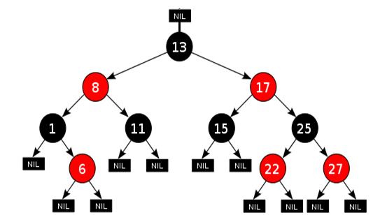

# 5.3.2 트리


## 1. 개념

- 노드들이 나무가지처럼 연결된 비선형 계층적 자료구조
- 트리 내에 트리가 있는 재귀적 자료 구조
- 원소들 간에 1:n관계를 가지는 자료구조
- 예
  - 파일 및 폴더

## 2. 정의

- 한개 이상의 노드로  이루어진 유한 집합
- **조건**
    1. 루트 : 노드 중 최상위 노드
    2. 나머지 노드들은 n개의 분리집합(T1, T2, Tn)으로 분리 가능
- 분리집합은 하나의 트리가 되며 루트의 부트리(sbutree)라 한다.
  
## 3. 구성

- 루트 : 차상위 노드
- 부모 노드 : 임의의 노드에서 한 단계 상위 노드
- 자식 노드 : 임의의 노드의 한 단계 하위 노드
- 형제 노드 : 같은 레벨의 노드ㅈ

## 4. 용어

- 노드 : 트리를 구성하는 기본 요소
- 간선(edge) : 노드와 노드간 연결선
- 루트 :트리 구조에서 부모가 없는 최상위 노드
- 깊이 : 각 노드마다 다르며 루트 노드부터 특정 노드까지 최단 거리로 갔을 때의 거리
- Level : 루트 노드의 레벨을 0레벨이라 한다면, 루트 노드의 자식 레벨은 1 레벨
- 높이 : 루트 노드부터 리프노드까지 거리 중 가장 긴 거리를 의미
- **degree : 노드의 자식 수**
  - **노드의 차수 : 노드에 연결된 자식 노드의 수**
  - **트리의  차수 : 트리에 있는 노드의 차수 중에서 가장 큰 값**
  - 단말 노드(리프 노드) : 차수가 0인 노드. 자식 노드가 없는 노드
- path : 한 노드에서 다른 한 노드에서 이르는 길 사이에 놓여 있는 노드들의 순서
- distance :두 노드 사이의 최단 경로에 있는 간선 수
- 서브트리 : 트리 내의 하위 집합
    - 트리 내에 있는 부분 집합

## 5. 이진트리

- 모든 노드들이 최대 2개의 자식 노드를 갖는 특별한 형태의 트리
- 각 노드가 자식 노드를 최대 2개까지만 가질 수 있는 트리
    - 왼쪽 자식 노드(left child node)
    - 오른쪽 자식 노드(right child node)
- 레벨 i에서의 노드의 최대 개수 : 2**i개
- 높이가 h인 이진트리
    - 노드의 최소 개수 : h + 1
    - 노드의 최대 개수 : 2**(h+1) -1

## 5.1 이진트리 종류


### 5.1.1 정이진(적정 이진) 트리(Full Binary Tree)

- 각 내부 노드가 두 개의 자식 노드를 갖는 순서화된 트리. 
  - 홀수 개의 자식 노드를 가질 수 없음

### 5.1.2 완전 이진 트리(Complete Binary Tree)

- 왼쪽에서부터 채워져 있는 이진 트리
    - 마지막 레벨을 제외하고는 모든 레벨이 완전히 채워져 있음
    - 마지막 레벨의 경우 왼쪽부터 채워져 있음
- 높이가 h이고 노드 수가 n개 일 때 (단 h + 1 ≤ n < 2**(h + 1)-1),  포화 이진트리의 노드 번호 1부터 n번까지 빈 자리가 없는 이진트리
- 예) 노드가 10개인 완전이진트리

### 5.1.3 변질 이진 트리(degenerate binary tree)

- 자식 노드가 하나밖에 없는 이진 트리

### 5.1.4 포화 이진 트리(perfect binary tree)

- 모든 레벨에 노드가 포화상태로 차 있는 이진트리
- 높이가 h일 때, 최대의 노드 개수인(2**(h+1)-1)의 노드를 가진 이진트리
    - 높이가 3일 때 15개의 노드를 가짐
- 루트를 1번으로 하여 2**(h +1)-1까지 정해진 위치에 대한 노드 번호를 가짐

### 5.1.5 균형 이진 트리(balanced binary tree)

- 왼쪽과 오른쪽 노드의 높이 차이가 1 이하인 이진 트리를 의미
- 예 > map, set을 구성하는 `레드 블랙 트리`

### 5.1.6 편향 이진 트리(skewed binary tree)

- 높이 h에 대한 최소 개수의 노드를 가지면서 한쪽 방향의 자식 노드만을 가진 이진트리
    - 왼쪽 편향 이진 트리
    - 오른쪽 편향 이진 트리


## 5.2. 순회(traversal)
<details>

<summary>순회</summary>
<div markdown="1">

- 트리의 각 노드를 중복되지않계 전부 방문하는 것
- 트리는 비선형 구조이기 때문에 선형구조에서 같이 선후 연결관계를 알 수 없음
    - 특별한 방법: 순회

### — 2.1 기본적인 순회방법

1. 전위 순회(preoder traversal) VLR
    - 부모노드 방문 후, 자식 노드를 좌, 우 순서로 방문
2. 중위 순회(inorder traversal) : LRV
    - 왼쪽자식노드, 부모노드, 오른쪽자식노드 순으로 방문
3. 후위 순회(postorder traversal) : LRV)
    - 자식 노드를 좌우 순서로 방문 후 부모노드 방문

### — 2.2 전위 순회(preoder traversal)

- 수행방법
    1. 현재 노드 n  방문 (V)
    2. 현재 노드 n의 왼쪽 서브트리로 이동(L)
    3. 현재 노드 n의 오른쪽 서브트리로 이동(R)
- 전위순회 알고리즘
    
### — 2.3 중위 순회(inoder traversal)

- 수행방법
    1. 현재 노드 n의 왼쪽 서브트리로 이동(L)
    2. 현재 노드 n  방문 (V)
    3. 현재 노드 n의 오른쪽 서브트리로 이동(R)
- 중위순회 알고리즘
    
### — 2.4 후위 순회(postoder traversal)

- 수행방법
    1. 현재 노드 n의 왼쪽 서브트리로 이동(L)
    2. 현재 노드 n의 오른쪽 서브트리로 이동(R)
    3. 현재 노드 n  방문 (V)
- 중위순회 알고리즘
    
## - 3. 이진트리의 표현

### — 3.1 배열

- 이진 트리에 각노드번호를 부여
- 루트의 번호 : 1
- 레벨 n에 있는 노드에 대하여 왼쪽에서부터 오른쪽으로 2**n부터 n(n +1) -1 까지 번호를 차례로 호출
- **노드 번호의 성질**
    - 노드 번호가 i인 노드의 부모노드 번호 : i//2
    - 노드번호가 i 인 노드의 왼쪽 자식 노드 : 2*i
    - 노드번호가 i 인 노드의 왼쪽 자식 노드 : 2*i
    - 레벨 n의 노드 번호 시작  번호 ? 2**
- 노드 번호를 배열에 인덱스 사용
- 높이 h인 이진트리를 위한 배열의 크기는?
    - 레벨 i의 최대 노드 수 : 2**i
    - 따라서 2**(h+1) -1
- **배열**
- 편향 이진트리의 경우 사용하지 않는 배열 원소에 대한 메모리 공간 낭비
- 트리의 중간에 새로운 노드를 삽입하거나 기존 노드를 삭제할 경우 배열의 변경 어려워 비효율적

### 이진 트리의 저장

1. 부모 번호를 인덱스로 자식번호를 저장
    - 간선의 개수 4
    - 1 2 1 3 3 4 3 5 부모 자식순
    - p = [0, 1, 2, 3, 4, 5]
    - c1 = [ 0, 2, 0, 4, 0 ,0]
    - c2 = [ 0, 3, 0, 5, 0 ,0]
2. 자식번호를 인덱스로 부모 번호를 저장
    - 간선의 개수 4
    - 1 2 1 3 3 4 3 5 부모 자식순
    - c = [0, 0, 1, 1, 3, 3]

```python
# 루트 찾기
def find_root(V):
    for i in range(1, V+1):
        if par[i] == 0:
            return i
# 전위 순회
def preorder(n):
    if n:
        print(n, end=' ')
        preorder(c1[n])
        preorder(c2[n])

# 중위 순회
def inorder(n):
    if n:
        inorder(c1[n])
        print(n, end=' ')
        inorder(c2[n])        

# 후위 순회
def postorder(n):
    if n:
        postorder(c1[n])
        postorder(c2[n])
        print(n, end=' ')

        
E = int(input()) # 간선 수
arr = list(map(int, input().split()))
V = E + 1 # 노드 수

# 부모 번호를 인덱스로 사용한 자식 노드 위치
c1 = [0] * (V + 1)
c2 = [0] * (V + 1)
# 자식 번호를 인덱스로 사용한 부모 노드 위치
par = [0] * (V + 1)

for i in range(E):
    p, c = arr[i*2], arr[i*2+1]
    if c1[p]==0:
        c1[p] = c
    else:
        c2[p] = c
    par[c] = p

root = find_root(V)

preorder(root)
print()
inorder(root)
print()
postorder(root)
```

### — 3.2 연결리스트

- 배열을 이용한 트리의 표현의 단점을 보완하기 위해 연결리스트 사용
- 이진 트리의 모든 노드는 최대 2개의 자식 노드
    - 일정한 구조의 단순 연결리스트 노드를 사용하여 구현할 수 있음
    - arr = [left, 데이터, right]

### <연습문제>

```python
# 연결리스트

# 13
# 1 2 1 3 2 4 3 5 3 6 4 7 5 8 5 9 6 10 6 11 7 12 11 13

def preorder(n):
    
    if n:
        print(n)
        for i in range(len(LKL[n])):
            preorder(LKL[n][i])

v = int(input())
e = v - 1

LKL = [[] for i in range(v + 1)]
edges = list(map(int, input().split()))

for i in range(0, e*2, 2):
    LKL[edges[i]].append(edges[i+1])

# **[[], [2, 3], [4], [5, 6], [7], [8, 9], [10, 11], [12], [], [], [], [13], [], []]**
preorder(1)
# 1 2 4 7 12 3 5 8 9 6 10 11 13
```

### <연습문제> 3을 루트로하는 서브트리에 속한 정점의 개수는?

```python
# 연결리스트

# 13
# 1 2 1 3 2 4 3 5 3 6 4 7 5 8 5 9 6 10 6 11 7 12 11 13

def preorder(n):
    global cnt
    if n:
        cnt += 1
        for i in range(len(LKL[n])):
            preorder(LKL[n][i])

v = int(input())
e = v - 1

LKL = [[] for i in range(v + 1)]
edges = list(map(int, input().split()))

for i in range(0, e*2, 2):
    LKL[edges[i]].append(edges[i+1])

cnt = 0
preorder(3)
print(cnt)
# 8
```

### <연습문제> global cnt 없이 순회한 정점 수를 리턴하는 함수

```python
# 13
# 1 2 1 3 2 4 3 5 3 6 4 7 5 8 5 9 6 10 6 11 7 12 11 13
def f(n):
    if n == 0:
        return 0
    else:
        L = f(c1[n])
        R = f(c2[n])
        return L + R + 1

def find_root(V):
    for i in range(1, V+1):
        if par[i] == 0:
            return i
        
E = int(input()) # 간선 수
arr = list(map(int, input().split()))
V = E + 1 # 노드 수

# 부모 번호를 인덱스로 사용한 자식 노드 위치
c1 = [0] * (V + 1)
c2 = [0] * (V + 1)
# 자식 번호를 인덱스로 사용한 부모 노드 위치
par = [0] * (V + 1)

for i in range(E):
    p, c = arr[i*2], arr[i*2+1]
    if c1[p]==0:
        c1[p] = c
    else:
        c2[p] = c
    par[c] = p
    
root = find_root(V)
print(f(root))
```

</div>
</details>

## 5.3 이진 탐색 트리(BST)


- 탐색작업을 효율적으로 하기 위한 자료구조
- 모든 원소는 서로 다른 유일한 키가 됨
- key(왼쪽 서브트리) < key(루트, 노드) < key(오른쪽 서브트리)
- 왼쪽 서브트리와 오른쪽 서브트리도 이진 탐색 트리
- 중위 순회하면 오른 차순으로 정렬된 값을 얻을 수 있음

### 1. 탐색 연산

- 루트에서 시작
- 탐색할 키 값 x를 루트  노드의 키 값과 비교
    - case1 : 키 값 x = 루트노드의 키 값 : 원하는 원소를 찾았으므로 탐색연산 성공
    - case2 : 키 값 x < 루트노드의 키 값 : 루트노드의 왼쪽 서브트리에 대해서 탐색연산 수행
    - case2 : 키 값 x > 루트노드의 키 값 : 루트노드의 오른쪽쪽 서브트리에 대해서 탐색연산 수행

### 1.1 삽입 연산


1. 먼저 탐색 연산을 수행
    - 삽입할 원소와 같은 원소가 트리에 있으면 삽입할 수 없으므로, 같은 원소가 트리에 있는지 탐색
    - 탐색에서 탐색 실패가 결정되는 위치가 삽입 위치가 됨
2. 탐색 실패한 위치에 원소를 삽입

### 1.2. 삭제 연산

1. 탐색 연산 수행


2. 차수가 0인 경우(외부 노드 삭제 연산일 경우)
    1. 키 값 search한 뒤 해당 노드를 부모 노드와 끊어주기


3. 차수가 1인 경우(한 개의 서브트리가 있을 떄)
    - 왼쪽 서브트리나 오른쪽 서브트리 중 하나를 가지고 있을 떄
    - 해당 노드를 삭제하고 서브트리를 부모 노드에 연결시키기


4. 차수가 2인 경우(두 개의 서브트리가 있을 떄)
    - 삭제할 노드의 후손들 중 삭제할 노드와 가장 비슷한 키를 가진 노드를 찾아야 함
        1. 삭제할 노드의 왼쪽 서브트리의 가장 큰 값
            - 왼쪽 서브트리의 가장 오른쪽에 있는 노드
        2. 삭제할 노드의 왼쪽 서브트리의 가장 작은 값
            - 오른쪽 서브트리의 가장 왼쪽에 있는 노드

### 2. 성능

- 탐색(searching), 삽입(insertion), 삭제(delection) 시간은 트리의 높이만큼 시간이 걸린다.
    - O(h), h : BST의 깊이(height)
- 평균의 경우
    - 이진 트리가 균형적으로 생성되어 있는 경우
    - O(logn)
- 최악의 경우
    - 한쪽으로 치우쳐진 경사 이진트리의 경우
    - O(n)
    - 순차 탐색과 시간복잡도가 같다

### 3. 검색 알고리즘 성능 비교

- 배열에서 순차 검색 : O(N)
- 정렬된 베열에서의 순차검색 : O(N)
- **정렬된 배열에서의 이진 검색 : O(logN)**
    - 고정 배열 크기와 삽입, 삭제 시 추가 연산 필요
- **이진 탐색 트리에서의 평균 : O(logN)**
    - 최악의 경우 : O(n)
    - 완전 이진 트리 또는 균형트리로 바꿀 수 있다면 최악의 경우를 없앨 수 있음
    - 새로운 원소를 삽입할 때 삽입 시간 줄어듬
    - 평군과 최악의 시간은 같음O(logn)
- 해쉬 검색 O(1)
    - 추가 저장 공간이 필요


## 5.4 AVL 트리


- Adelson-Velsky and Ladis tree
- 이진 탐색 트리의 최악의 경우인 선형적인 트리가 되는 것을 방지하고 스스로 균형을 잡는 이진 탐색 트리

### 특징

1. 이진 탐색 트리의 속성을 가진다.
2. 두 자식 서브트리의 높이는 항상 최대 1만큼 차이난다.
3. 높이 차이가 1보다 커지면 회전(rotation)을 통해 균형을 맞춰 높이 차이를 줄인다.4. 삽입, 검색, 삭제의 시간 복잡도가 O(log(n))이다.

> Valance Factor (BF)
> - 균형이 무너졌는지에 대핸 판단할 때 사용
> - BF(K) = K의 왼쪽 서브트리의 높이 - K의 오른쪽 서브트리의 높이
> - BF가 1보다 클 때 회전 실행

### 회전 연산


1. 우회전
    1. y노드의 오른쪽 자식 노드를 z노드로 변경한다.
    2. z노드 왼쪽 자식 노드를 y노드의 오른쪽 서브트리(T2)로 변경한다.


2. 좌회전
    1. y노드의 왼쪽 자식 노드를 z노드로 변경한다.
    2. z노드 오른쪽 자식노드를 y노드의 왼쪽 서브트리(T2)로 변경한다.


### 4가지 불균형 CASE


1. LL(Left Left) Case
    1. 위 그림처럼 BF가 -1~1을 벗어난 노드를 기준으로 왼쪽, 왼쪽 노드가 존재하는 경우
    2. 이때 해당 노드를 기준으로 우회전을 적용하면 불균형이 해소됨


2.RR(Right Right) Case
    1. 위 그림처럼 BF가 -1~1을 벗어난 노드를 기준으로 오른쪽, 오른쪽 노드가 존재하는 경우
    2. 이때 해당 노드를 기준으로 좌회전을 적용하면 불균형이 해소된다


3. LR(Left Right) Case
    1. 위 그림처럼 BF가 -1~1을 벗어난 노드를 기준으로 왼쪽, 오른쪽 노드가 존재하는 경우
    2.이때 먼저 BF에 이상이 있는 노드(값이 4인노드)의 왼쪽 자식노드(값이 2인 노드)를 기준으로 좌회전을 진행
    3. 이후 BF에 이상이 있는 노드(값이 4인 노드)를 기준으로 우회전을 진행하면 불균형이 해소됨


3. RL(Right Left) Case
    1. 위 그림처럼 BF가 -1~1을 벗어난 노드를 기준으로 오른쪽(Right), 왼쪽(Left) 노드가 존재하는 경우
    2. 이때 먼저 BF에 이상이 있는 노드(값이 4인노드)의 오른쪽 자식노드(값이 4인 노드)를 기준으로 우회전을 진행
    이후 BF에 이상이 있는 노드(값이 4인 노드)를 기준으로 좌회전을 진행하면 불균형이 해소됨

## 5.4 레드 블랙 트리




> NIL node
> - 자식노드가 존재하지 않는 경우 NIL node라는 특수한 노드가 있다고 가정
> - 따라서 모든 laef 노드는 NIL이 됨
> - root node의 부모도 NIL 노드라고 가정


- 균형 이진 탐색 트리의 일종
- 각 노드는 빨간색 또는 검정색 색상을 나타내는 추가 비트를 저장함
    - 삽입 및 삭제 과정에서 트리가 균형을 유지하도록 사용

- 다음 5가지 조건을 만족하는 이진 탐색 트리
    1. 각 노드의 색은 RED OR BLACK이다.
    2. ROOT노드는 BLACK
    3. 모든 리프노드는 BLACK
    4. RED노드의 자식 노드들은 전부 BLACK
    5. ROOT노드에서 시작해서 자손인 LEAF노드에 이르는 모든 경로에는 동일한 개수의 BLACK 노드가 존재함


## 정리

