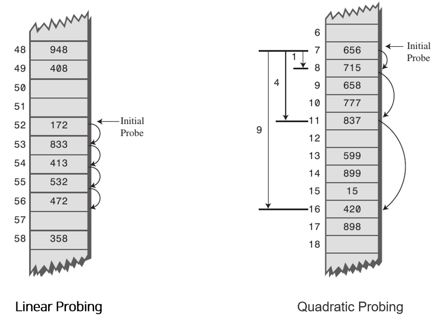

# 5.3.7_해시 테이블

## 1. 해시 테이블(HashTable)

### 1.1 해시 테이블 구조
- (Key, Value)로 데이터를 저장하는 자료구조 중 하나로 빠르게 데이터를 검색할 수 있는 자료구조
- 내부적으로 배열(버킷)을 사용하여 데이터를 저장
- 각각의 Key값에 해시함수를 적용해 배열의 고유한 index를 생성하고, 이 index를 활용해 값을 저장하거나 검색
- 여기서 실제 값이 저장되는 장소를 버킷 또는 슬롯이라고 함

### 1.2 해시 테이블 예시

- ("John Smith", "521-1234")인 데이터를 크기가 16인 해시 테이블에 저장할 때
	1. index = hash_function("John Smith") % 16 연산을 통해 index 값을 계산
	2. buckets[index] = "521-1234" 로 전화번호를 저장

- 이러한 해싱 구조로 데이터를 저장하면 Key값으로 데이터를 찾을 때 해시 함수를 1번만 수행하면 되므로 매우 빠르게 데이터를 저장/삭제/조회할 수 있음
- 해시테이블의 평균 시간복잡도는 **O(1)**

## 2. 해시 함수

- 해시 함수에서 중요한 것은 **고유한 인덱스 값을 설정**하는 것 (원활한 검색을 위해)
- 해시 테이블에 사용되는 대표적인 해시 함수로는 4가지가 있음
	1.  Division Method
		- 나눗셈을 이용하는 방법으로 입력값을 테이블의 크기로 나누어 나머지를 인덱스로 가져가는 방법
		- 주소 = 입력값 % 테이블의 크기
	2.  Digit Folding
		- 각 Key의 문자열을 ASCII 코드로 바꾸고 값을 합한 데이터를 테이블 내의 주소로 사용하는 방법
	3.  Multiplication Method
		- 숫자로 된 Key값 K와 0과 1사이의 실수 A, 보통 2의 제곱수인 m을 사용하여 다음과 같은 계산을 하는 방법
		- h(k)=(kAmod1) × m
	4.  Univeral Hashing
		- 다수의 해시함수를 만들어 집합 H에 넣어두고, 무작위로 해시함수를 선택해 해시값을 만드는 방법

## 3. 해시(Hash)값이 충돌하는 경우

- 위 예시에서 만약 "John Smith"를 해시 함수를 돌려 나온 값과 "Mang Kyu"를 해시 함수를 돌려 나온 값이 동일하다면? >> 충돌을 해결해주어야 함
- 해시 테이블에서는 충돌에 의한 문제를 분리 연결법(Separate Chaining)과 개방 주소법(Open Addressing) 크게 2가지로 해결하고 있음

### 3.1 분리 연결법 (Separate Chaining)

- 동일한 버킷의 데이터에 대해 자료구조를 활용해 추가 메모리를 사용하여 다음 데이터의 주소를 저장하는 방법
- 위의 그림과 같이 동일한 버킷으로 접근을 한다면 데이터들을 연결을 해서 관리함
- 이러한 Chaining 방식은 해시 테이블의 확장이 필요없고 간단하게 구현이 가능하며, 손쉽게 삭제할 수 있다는 장점음
- 하지만 데이터의 수가 많아지면 동일한 버킷에 chaining되는 데이터가 많아지며 그에 따라 캐시의 효율성이 감소한다는 단점이 있음

### 3.2 개방 주소법 (Open Addressing)
- 추가적인 메모리를 사용하는 Chaining 방식과 다르게 비어있는 해시 테이블의 공간을 활용하는 방법
- Open Addressing을 구현하기 위한 대표적인 방법으로는 3가지 방식이 존재
	1.  Linear Probing
		- 현재의 버킷 index로부터 고정폭 만큼씩 이동하여 차례대로 검색해 비어 있는 버킷에 데이터를 저장하는 방법
	2.  Quadratic Probing
		- 해시의 저장순서 폭을 제곱으로 저장하는 방법
		- ex) 처음 충돌이 발생한 경우에는 1만큼 이동하고 그 다음 계속 충돌이 발생하면 2^2, 3^2 칸씩 옮김
	3. Double Hashing Probing
		- 해시된 값을 한번 더 해싱하여 해시의 규칙성을 없애버리는 방식
		- 해시된 값을 한번 더 해싱하여 새로운 주소를 할당하기 때문에 다른 방법들보다 많은 연산을 하게 됨

## 4. 해시 테이블(HashTable) 시간복잡도
### 4.1 해시 테이블 시간 복잡도
- 각각의 Key값은 해시함수에 의해 고유한 index를 가지게 되어 바로 접근할 수 있으므로 **평균 O(1)의 시간복잡도**로 데이터를 조회할 수 있음
- 하지만 데이터의 충돌이 발생한 경우 Chaining에 연결된 리스트들까지 검색을 해야 하므로 **O(N)까지 시간복잡도가 증가할 수 있음**

### 4.2 충돌 방지 방법을 사용할 경우
- 충돌을 방지하는 방법들은 데이터의 규칙성(클러스터링)을 방지하기 위한 방식이지만 공간을 많이 사용한다는 치명적인 단점이 있음
- 만약 테이블이 꽉 차있는 경우라면 테이블을 확장해주어야 하는데, 이는 매우 심각한 성능의 저하를 불러오기 때문에 가급적이면 확장을 하지 않도록 테이블을 설계해주어야 함
	- 통계적으로 해시 테이블의 공간 사용률이 70% ~ 80%정도가 되면 해시의 충돌이 빈번하게 발생하여 성능이 저하되기 시작함
- 해시 테이블에서 자주 사용하게 되는 데이터를 Cache에 적용하면 효율을 높일 수 있음

